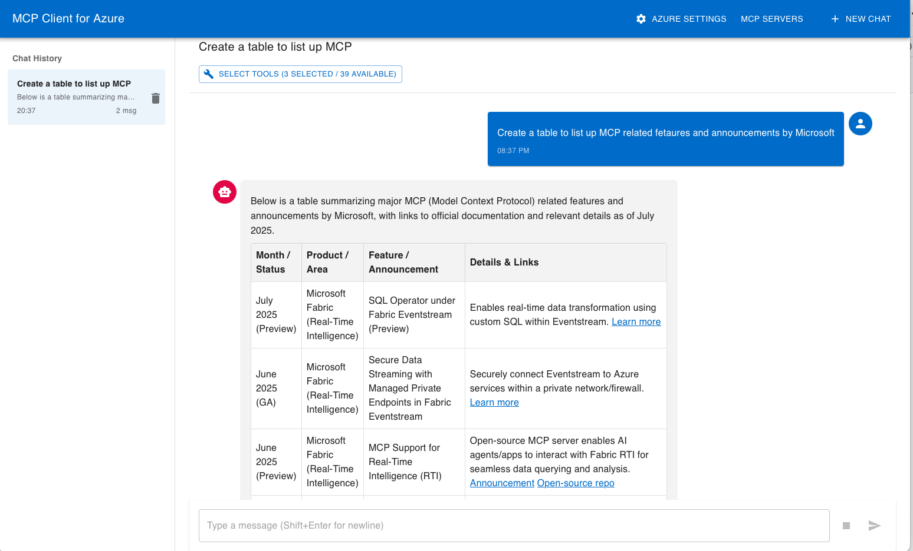

# MCP Client for Azure

A Model Context Protocol (MCP) client that integrates seamlessly with Azure OpenAI. It can connect to multiple MCP servers and includes a flexible tool-execution approval system.

## Features

- **Azure OpenAI Integration** – Works out-of-the-box with Azure OpenAI.
- **Multiple MCP Server Types** – Supports STDIO, SSE, and HTTP.
- **Tool Approval Dialog** – Choose *Allow*, *Allow All*, or *Deny* for each tool call.
- **Saved Server Management** – Persist and reuse MCP server settings.
- **Session Management** – Store every chat as a local file for later reload.
- **Modern UI** – Built with Material-UI.
- **Ready to Run** – Download single binary packaged for Windows/MacOS.



Repository Link: https://github.com/hatasaki/MCP-Client-for-Azure

## Getting Started

### 0. Download the Binary
1. Grab the latest release from GitHub: https://github.com/hatasaki/MCP-Client-for-Azure/releases
2. Extract an executable file
> **Windows users**
> 1. After extracting, copy **`mcpclient.exe`** to any folder and double-click it to launch.
> 2. A confirmation message will appear when you run the program. Please follow the on-screen instructions.

> **macOS users**
> 1. After extracting, copy **`mcpclient.app`** to any folder and double-click it, or drag it into your **Applications** folder.
> 2. The first time you start the app, macOS may block it because it was downloaded from the internet. Open **System Settings → Privacy & Security** and click **Open Anyway** to allow the application to run.

### 1. First Launch – Choose a Data Directory
- When you start MCP Client for Azure for the first time, a dialog asks where to store settings and chat history.  The path you pick is saved to `.mcpclient/mcpclient.conf` at your home directory (`%USERPROFILE%\.mcpclient\mcpclient.conf` on Windows, `$HOME/.mcpclient/mcpclient.conf` on macOS).

### 2. Configure Azure OpenAI
1. Launch the app and click **Azure Settings**.
2. Enter your **Endpoint URL**, **Deployment name**, **API version**, and  (optionally) an **API key**.
   - If the API key field is left **blank**, the client will authenticate with **Entra ID (Azure AD)** using the credentials from browser login or `az login`.
   - In addition, you can configure system prompt, temperature, max_tokens.

### 3. Register MCP Servers
1. Click **MCP Servers**.
2. Select **Add New Server** and fill in the details.

**STDIO example**
```
Name: STDIO MCP Server
Type: STDIO
Command: npx
Args: -y @hoge/fuga
Env: HOGE_USER=john
```
> **Platform notes**
> - **macOS (.app build):** Apps started from Finder inherit a minimal `PATH`. If `npx`/`node` is installed via Homebrew (e.g. `/opt/homebrew/bin` or `/usr/local/bin`), add that directory to **Env → PATH**:  
>   **`PATH=/opt/homebrew/bin:/bin:/usr/bin:/usr/local/bin:$PATH`**
> - **Windows:** Specify **`npx.cmd`** instead of `npx` for **Command**.

**HTTP example**
```
Name: Remote HTTP Server
Type: HTTP
URL : http://remote.mcp.io/mcp
Header:
  "user-key": "secret"
```

### 4. Start Chatting
1. Click **New Session**.
2. Pick an MCP tool with **Select Tool**.
3. Type a message and send.
4. When a tool is called an approval dialog appears:
   - **Allow** – Run this one tool.
   - **Allow All** – Auto-approve all tools for this session (no more dialogs).
   - **Deny** – Cancel the tool call.
5. If you choose **Allow All**, the flag `autoApproveAll` is saved for that session so you will not be asked again.
6. All messages and tool results are stored in `data/sessions/<id>.json` and can be reopened from **Session List** after restarting the app.
7. Force a tool call – Prefix your message with `#<toolName>` to make sure the assistant calls that tool. For example, writing `#weather What's the weather today?` will always invoke the `weather` tool. The tool name must match one selected in **Select Tool**. The prefix is stripped before sending so the MCP server receives only the original question.

## Troubleshooting

### Connection Errors

1. **Azure OpenAI**
   - Check the endpoint URL.
   - Verify the API key.
   - Confirm the deployment name.

2. **MCP Server**
   - **STDIO:** Is the command path correct?
   - **HTTP:** Is the server running?
   - **SSE:** Is the URL correct?

## Disclaimer
This sample application is for testing, evaluation, and demos only. Use it at your own risk. It is not affiliated with or endorsed by the developer’s organization.

## Contributing
This project has adopted the [Microsoft Open Source Code of Conduct](https://opensource.microsoft.com/codeofconduct/). For more information see the [Code of Conduct FAQ](https://opensource.microsoft.com/codeofconduct/faq/) or contact [opencode@microsoft.com](mailto:opencode@microsoft.com) with any additional questions or comments.

## License

This project is licensed under the MIT License. See the [LICENSE](LICENSE) file for details.