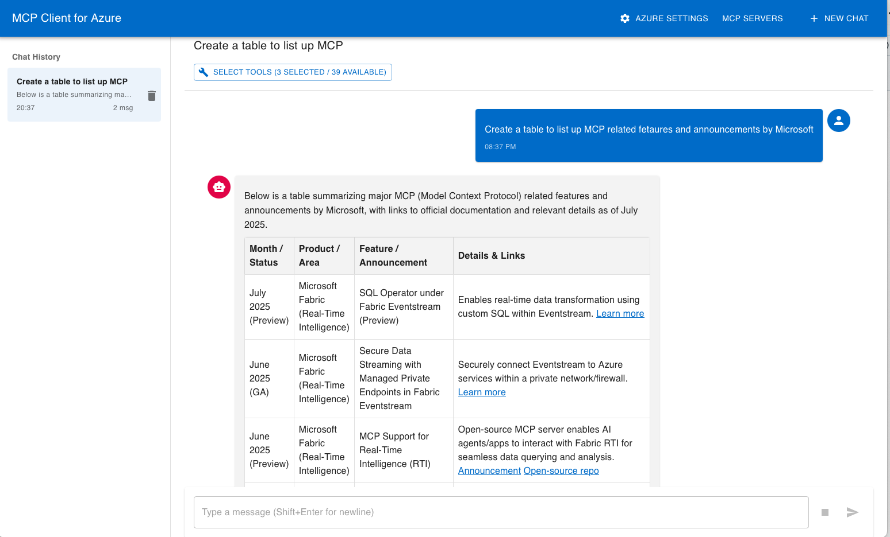

# MCP Client for Microsoft Foundry

A desktop and container-ready Model Context Protocol (MCP) client for Microsoft Foundry. The backend uses Microsoft Agent Framework (MAF) for provider calls, agent sessions, streaming, function invocation, and MCP tools; the frontend is a React/Material UI chat application.

> Related articles about the original Azure OpenAI version:
> - [Chat UI MCP Client App Integrates Azure OpenAI and MCP Servers](https://medium.com/@hatasaki/chat-ui-mcp-client-app-integrates-azure-openai-and-mcp-servers-works-on-windows-and-mac-08f6ed2672b7)
> - [Azure OpenAI と MCP を連携するチャット UI アプリを作りました](https://qiita.com/hatasaki/items/84316fff8db67bf39e0a)



## Highlights

- **Microsoft Agent Framework runtime** with opaque MAF session persistence.
- **Token streaming** with ordered Socket.IO events and partial-response display.
- **Real cancellation** of the active agent task, including approval waits.
- **Batched tool approval** with per-call decisions and session-scoped “Always allow all”.
- **MAF-native MCP tools** over Streamable HTTP or STDIO.
- **OAuth 2.0 for remote MCP servers** with flow-specific callback routing.
- **Typed provider parameters** where empty means omit and explicit `false`, `0`, and `none` remain distinct.
- **Multiple model deployments per endpoint**, with API-specific profiles and a persistent model choice for each chat.
- **AES-256-GCM API-key encryption** backed by Windows Credential Manager, macOS Keychain, or an injected container secret.
- **Atomic settings/session persistence** and one-time encrypted legacy settings migration.
- **Windows, macOS, and headless container packaging**.

## Supported Foundry routes

| Endpoint kind | API | Version mode | Authentication |
|---|---|---|---|
| Foundry Project | Responses | `v1` | Microsoft Entra ID only |
| Model endpoint | Responses | `v1` or dated Azure API | API key or Entra ID |
| Model endpoint | Chat Completions | `v1` or dated Azure API | API key or Entra ID |
| Model endpoint | Claude Messages | Provider version | API key or Entra ID |

Project endpoints must end in `/api/projects/{project-name}`. MAF `FoundryChatClient` authenticates this route with Entra ID. To use a resource API key, select **Model endpoint**; model endpoints do not expose Project-scoped connections or other Project capabilities.

Claude support uses the beta MAF Anthropic connector. Its `max_tokens` setting is required.

## Desktop installation

1. Download the latest archive from [GitHub Releases](https://github.com/hatasaki/MCP-Client-App-for-Azure/releases).
2. Extract the archive. The standard Windows archive contains the original single `mcpclient.exe`. If an enterprise Code Integrity policy blocks `_MEI*` DLL loading, use the `windows-onedir` archive, keep its folder together, and start `mcpclient-onedir/mcpclient.exe`. On macOS, start `mcpclient.app`.
3. On first launch, choose a directory for settings and chat history.

On macOS, an unsigned downloaded app might require **System Settings → Privacy & Security → Open Anyway**.

If macOS still blocks the app, remove the quarantine attribute from this app only, then launch it. The following example assumes that `mcpclient.app` was copied to `/Applications`:

```bash
xattr -dr com.apple.quarantine "/Applications/mcpclient.app"
open "/Applications/mcpclient.app"
```

Replace the path if the app is stored elsewhere. Run this only after verifying that the archive was downloaded from this repository's GitHub Releases page. Do not disable Gatekeeper globally, and do not use `sudo` unless the app's file permissions specifically require it.

Windows desktop builds use the current pywebview WebView2 backend. Windows 10/11 normally includes the Microsoft Edge WebView2 Runtime; install or repair that runtime if the application window cannot be created.

## Configure Microsoft Foundry

Open **Foundry Settings**, then select the endpoint kind, API, version mode, authentication method, and model deployments.

- Project endpoints lock API to Responses, version to `v1`, and authentication to Entra ID.
- Model endpoints permit API key or Entra ID.
- Enter one or more deployment names. A blank trailing row appears automatically, and names must be unique within an API type.
- Responses, Chat Completions, and Claude Messages each retain their own model list, version settings, and typed options when switching API in the settings dialog. The same deployment name can be used by different API types.
- Authentication belongs to the endpoint and appears directly below it. Model endpoints support API key or Entra ID; Project endpoints remain Entra ID-only.
- Select one **Default model for chats** across all configured API profiles. API Type-specific default models are not stored.
- API keys support explicit **keep**, **replace**, and **clear** behavior. They are AES-256-GCM encrypted at rest and are never returned by the REST settings API or stored in browser local storage.
- Every Foundry endpoint must use HTTPS. For API-key authentication, authenticated encryption also binds the key to the persisted endpoint, profiles, instructions, authentication type, schema, and credential revision, so editing or transplanting those fields invalidates decryption.
- Optional parameter fields are omitted when empty. Boolean `false`, numeric `0`, and reasoning effort `none` are sent explicitly.

`DefaultAzureCredential` is used for Entra ID. A developer can normally authenticate with Azure CLI, environment/workload identity, managed identity, or interactive browser credentials supported by Azure Identity.

### Settings file

The logical `FoundrySettings.json` structure is:

```json
{
  "schemaVersion": 4,
  "endpointKind": "model",
  "endpoint": "https://resource.services.ai.azure.com",
  "auth": {
    "type": "api_key",
    "apiKeyEncrypted": {
      "version": 1,
      "algorithm": "AES-256-GCM",
      "keyId": "...",
      "nonce": "...",
      "ciphertext": "..."
    }
  },
  "agentInstructions": "...",
  "apiProfiles": [
    {
      "apiType": "responses",
      "models": ["gpt-primary", "gpt-secondary"],
      "versionMode": "v1",
      "options": { "store": false }
    },
    {
      "apiType": "chat_completions",
      "models": ["gpt-chat"],
      "versionMode": "dated",
      "apiVersion": "2025-04-01-preview",
      "options": {}
    }
  ],
  "defaultSelection": {
    "apiType": "responses",
    "model": "gpt-primary"
  },
  "credentialRevision": 1
}
```

`auth` applies to the endpoint and all API profiles. `apiProfiles` do not contain `defaultModel`; `defaultSelection` is the only chat default. The REST API never returns `apiKeyEncrypted`, `credentialRevision`, or plaintext key material.

### Legacy migration

A valid legacy `AzureOpenAI.json` or single-profile `FoundrySettings.json` is migrated on first load. Legacy endpoint, deployment, API type/version, system prompt, generation parameters, authentication, and reasoning settings are retained where supported. Any plaintext API key is encrypted before the current settings file atomically replaces the old data. Unsupported schema versions are rejected, and no plaintext backup is created.

## Connect MCP servers

Open **MCP Servers** and add one of these transports:

1. **HTTP** — MCP Streamable HTTP, with optional headers and OAuth.
2. **STDIO** — executable, arguments, working directory, and environment variables.
3. **SSE** — retained as a display/config alias for Streamable HTTP. Legacy GET+POST SSE transport is not used.

Key/value editors automatically append a blank row; a separate Add button is not required.

### STDIO examples

Windows:

```text
Name: Files
Protocol: STDIO
Executable Path: npx.cmd
Arguments: -y @modelcontextprotocol/server-filesystem C:\work
```

macOS apps launched from Finder inherit a restricted `PATH`. Use an absolute executable path or add the needed locations to the server environment, such as `/opt/homebrew/bin:/usr/local/bin:/usr/bin:/bin`.

### HTTP example

```text
Name: Remote tools
Protocol: HTTP
URL: https://example.test/mcp
Header: Authorization = Bearer ...
```

Remote authorization follows the MCP OAuth flow. The app opens the authorization URL and receives the callback on its local backend.

## Chat, tools, approvals, and cancellation

1. Select **New Chat**.
2. Use the model selector below the input field to choose a configured deployment. Labels include the API type so identical deployment names remain distinguishable. Hover over the information icon for state-rebuild details.
3. Select individual MCP tools or all tools from one server.
4. Send a message and review streamed output.
5. For each approval batch, approve selected calls, deny all calls, or enable **Always allow all** for that chat session.
6. Select Stop to cancel the real in-flight task. Partial text is retained with `cancelled` status but is not replayed as completed history.

Tool IDs are qualified as `{server-id}:{remote-tool-name}`, preventing collisions between servers. To force one selected tool on the first model turn, prefix a prompt with its qualified ID, for example:

```text
#weather-server:get_forecast What is the forecast for Seattle?
```

The selected model is persisted per chat. Changing it is blocked during an active run. On the next message, provider-specific MAF state is rebuilt and only completed user/assistant text is replayed under that model's complete API profile. The same replay behavior applies when Foundry settings change; cancelled, interrupted, streaming, and error messages are excluded.

## Data and security

The desktop app stores the selected data directory in:

- Windows: `%USERPROFILE%\.mcpclient\mcpclient.conf`
- macOS/Linux: `$HOME/.mcpclient/mcpclient.conf`

The data directory contains:

- `FoundrySettings.json` — endpoint, API-specific model profiles, parameters, and an AES-GCM encrypted API-key envelope when configured.
- `mcp.json` — saved MCP definitions, including configured headers/environment values.
- `sessions/*.json` — visible messages plus opaque MAF session state.

Desktop builds store the 256-bit encryption master key separately: Windows Credential Manager on Windows and login Keychain on macOS. `FoundrySettings.json` contains only `version`, `algorithm`, `keyId`, `nonce`, and authenticated ciphertext. Losing the OS credential prevents decryption; the status API exposes only validated non-secret profiles so the settings dialog can retain them while requiring a replacement API key. There is no plaintext fallback.

The other files can still contain MCP headers, environment variables, opaque provider state, or chat content. Protect the directory with operating-system permissions and do not commit or share it. The browser receives only redacted Foundry settings.

Optional keys in `mcpclient.conf`:

```json
{
  "data_dir": "C:\\path\\to\\data",
  "port": 3001,
  "log_file": "C:\\path\\to\\mcpclient.log"
}
```

## Run from source

Prerequisites: Python 3.10 or newer and Node.js 24 LTS.

```text
python -m venv .venv
.venv/Scripts/python -m pip install -r requirements-desktop.txt   # Windows
cd client
npm ci --legacy-peer-deps
npm run build
cd ..
.venv/Scripts/python app_runner.py
```

Use `.venv/bin/python` instead on macOS/Linux.

For a headless backend, install `requirements.txt`, set `MCPCLIENT_HEADLESS=1` and optionally `MCPCLIENT_DATA_DIR`, then run `python -m uvicorn backend.main:app --host 0.0.0.0 --port 3001`. API-key authentication additionally requires `MCPCLIENT_ENCRYPTION_KEY` as described below. Set `MCPCLIENT_CALLBACK_BASE_URL` when an MCP OAuth callback must use a different externally reachable origin. Requests are same-origin by default; set a comma-separated `MCPCLIENT_ALLOWED_ORIGINS` only when a separate frontend origin is required. `MCPCLIENT_OAUTH_TIMEOUT_SECONDS` defaults to 300.

## Container

The image runs as a non-root user, stores data in `/data`, and exposes a health check at `/healthz`.

API-key authentication in a container fails closed unless `MCPCLIENT_ENCRYPTION_KEY` is supplied as URL-safe base64 for exactly 32 bytes. Generate it once, store it in the deployment platform's secret manager, and keep using the same value with the persistent `/data` volume:

```text
python -c "from app.secret_protection import generate_master_key; print(generate_master_key())"
docker build -t mcp-client-foundry .
docker run --rm -p 3001:3001 -v mcpclient-data:/data -e MCPCLIENT_ENCRYPTION_KEY="<secret>" mcp-client-foundry
```

Do not put the key in the Dockerfile, image, source control, or settings JSON. If it is lost or changed, existing encrypted API keys cannot be decrypted and must be replaced. Entra ID configurations do not need this environment variable.

The default image build runs the Node 24 production build inside Docker. In a network-restricted environment, first run `npm run build` in `client`, then use `docker build --target runtime-prebuilt -t mcp-client-foundry .`; this uses the checked local `client/build` output while keeping the same Python runtime image.

For Entra ID in a container, provide a supported workload/environment/managed identity configuration. Interactive desktop login is not assumed.

## Tests

```text
python -m pytest -m "not live_foundry" -q
cd client
npm test -- --watchAll=false
npm run build
```

Provider wire tests use mock HTTP transports and verify exact URLs, authentication headers, typed request bodies, and explicit omit semantics.

Install `requirements-dev.txt` instead of `requirements.txt` before running Python tests.

The live Foundry test is opt-in because it requires credentials, network access, and can incur usage charges:

```text
RUN_FOUNDRY_LIVE_TESTS=1
FOUNDRY_PROJECT_ENDPOINT=https://resource.services.ai.azure.com/api/projects/project-name
FOUNDRY_MODEL=model-deployment
python -m pytest tests/test_live_foundry.py -q
```

No endpoint, model, or credential is hardcoded in the test suite.

## Packaging

Build the React client first. Windows has two specs: `pyinstaller --clean mcpclient_win.spec` preserves the original one-file distribution, while `pyinstaller --clean mcpclient_win_onedir.spec` creates the compatibility onedir distribution. Use `pyinstaller --clean mcpclient_mac.spec` on macOS. The specs collect concrete MAF provider modules, MCP modules, distribution metadata, and runtime assets. The onedir option is provided because some enterprise Code Integrity policies reject DLLs dynamically extracted by unsigned one-file applications under `_MEI*` with Bad Image status `0xc0e90002`.

### Release process

`version_info.txt` remains the single source of truth for desktop package and GitHub Release versions. Choosing and committing the next version is intentionally a manual release-owner action; GitHub Actions never rewrites the repository version.

1. From an up-to-date `main` branch, set the next four-part Windows version:

  ```text
  python scripts/version.py set <next-four-part-version>
  python scripts/version.py verify
  ```

  The command updates `filevers`, `prodvers`, `FileVersion`, and `ProductVersion` together. Direct manual editing remains possible, but all four values must match or CI stops before building.

2. Review the change, run the test/build commands above, commit `version_info.txt`, and push the commit to `main`.
3. In GitHub Actions, dispatch **Build and Release** from `main`. The workflow requires the version to be greater than the latest `v*` tag and rejects an existing tag before starting platform builds.
4. The workflow builds and smoke-tests Windows one-file, Windows onedir, and macOS packages; publishes SHA-256 checksums; creates tag `v<version>` at the dispatched commit; and creates one GitHub Release containing all assets.

The **Build Windows Packages** workflow is a non-release diagnostic workflow. It uploads Windows artifacts for the selected commit but deliberately does not create a tag or GitHub Release, preventing duplicate or partial releases.

The separate container workflow publishes both `:<version>` and `:latest` tags to GHCR using the same validated `version_info.txt` value.

## Disclaimer

This sample application is for testing, evaluation, and demos. Use it at your own risk. It is not an official Microsoft application.

## Contributing and license

This project follows the [Microsoft Open Source Code of Conduct](https://opensource.microsoft.com/codeofconduct/) and is licensed under the [MIT License](LICENSE).
